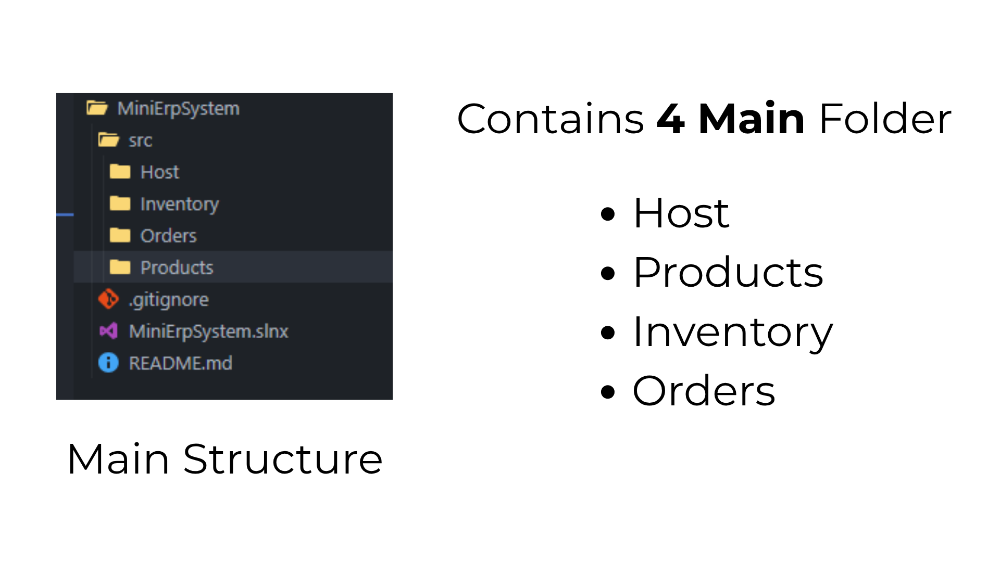
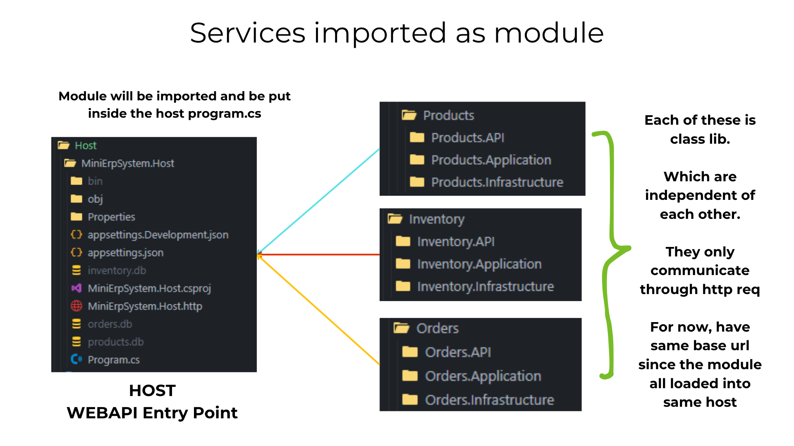
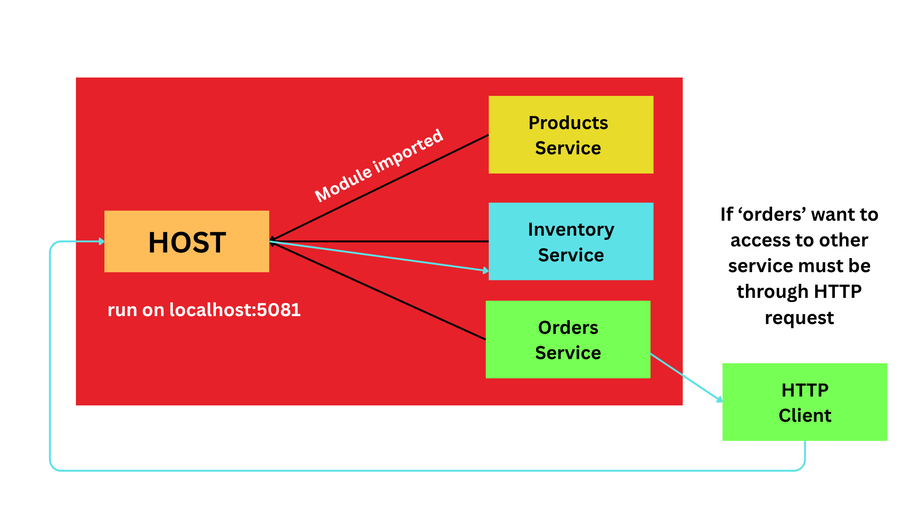
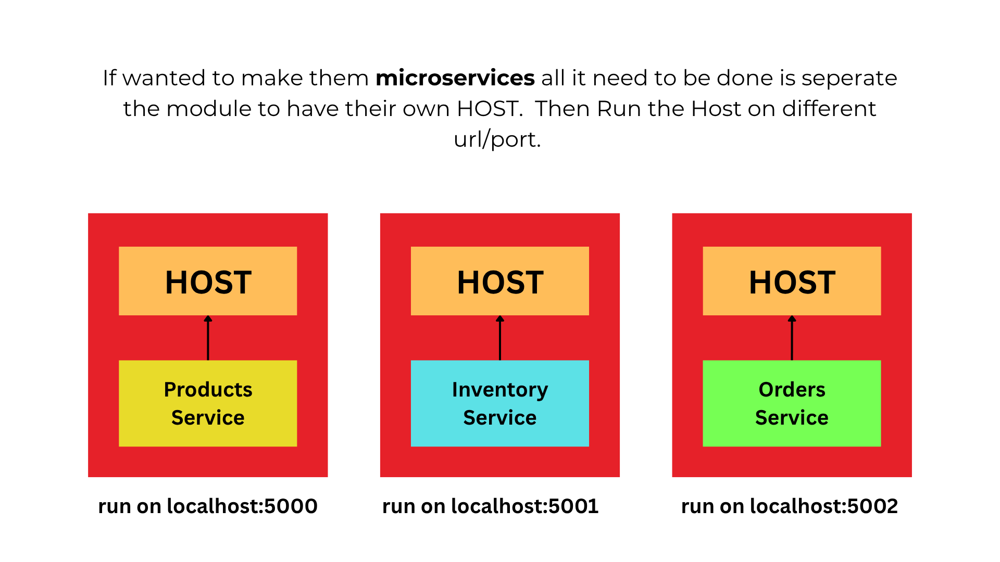
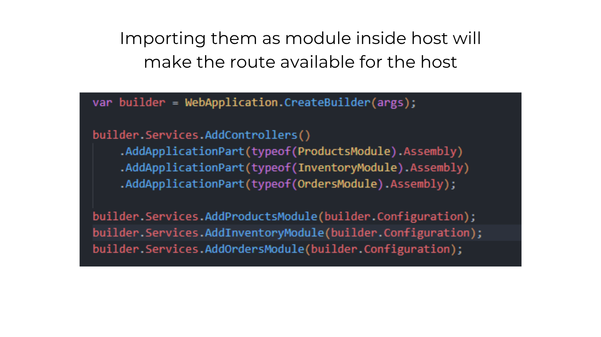
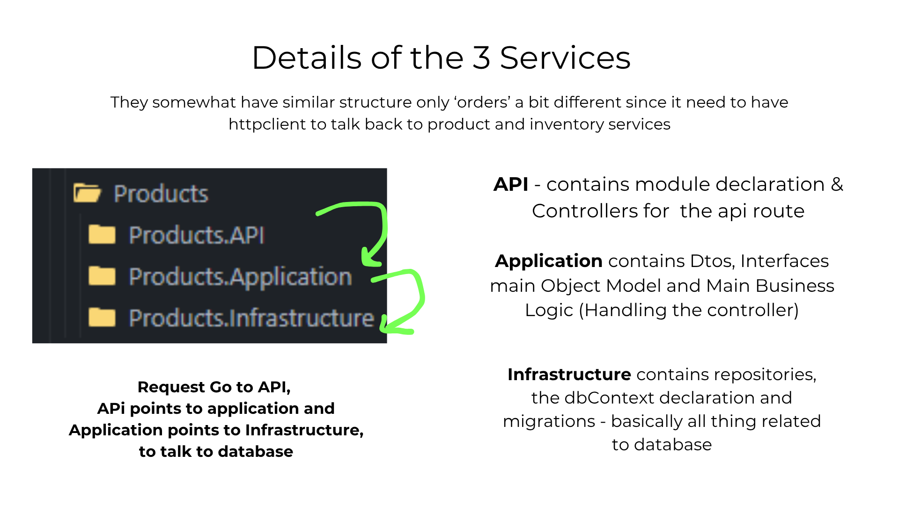
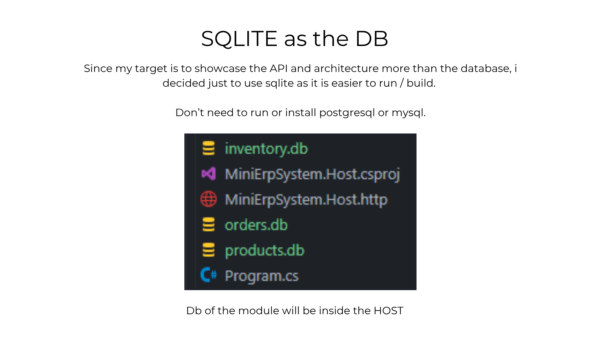
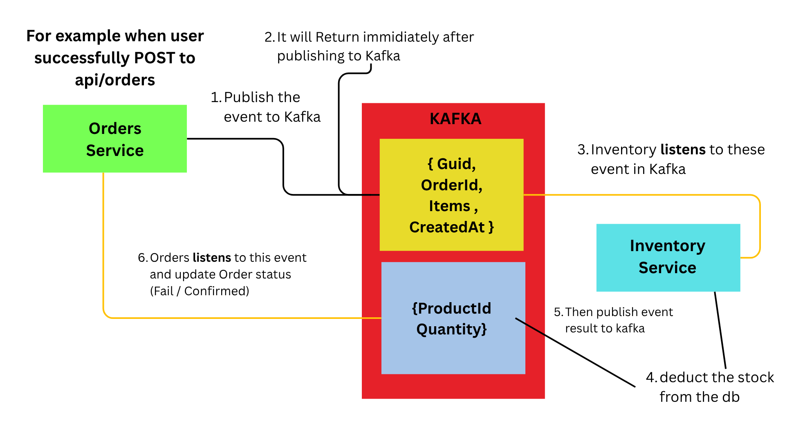

# Mini ERP system for Assessment.

Hi, this is my submission on technical assessment. Quick summary, to test the app all you need to do is below steps:

1. Clone the repo
2. In the root run `dotnet build`
3. Then run `dotnet run --project src/Host/MiniErpSystem.Host` (This project is monolith so only one service need to be run)

4. go to `localhost:5081/swagger` to see the api.

Info: This app use .NET 10.

For details of my thinking and structure of the app, I will explain briefly below:

## Implementation Details

Reading through the requirements pdf. The task basically ask for a simple ERP system where it contains **3 services**. Products, Inventory and Orders.

The key part here is, these 3 services has to be seperated. Means that one service doesnt really know each other, and can't call or edit other table directly. They can only talk through http request allowed by that said service API if needed to access data related to it.

This is actually my first building this kind of system design. 

Previous i just lump up all repo and service what not and seperate only by folder name. This of course will cause a massive dump in the folders.

So for this assessment, we need to make the service modular.

The architecture I decided on, after doing some googling and asking Dr.AI, is making a host (webapi) and the services as seperate classlib that will have it module called inside the host webapi main. 

Below is a illustarion of the program structure. I present as a slide.

### Concerns

I've done this on Sunday. Since i got only one day of creating this there are few compremise that I just pass through.

1. On GET routes, usually you want to add pagination and limit queries. You don't want your 'GET' all routes to be query large datasets from database. So GET all response suppose to have meta(pagination, limit). Not just for resource management but also make it easier for the front end to be setup.

2. For Kafka, i have quickly studied it. It is a distributed event streaming platform. Fancy name, but basically what it does it hold events that later any service can reference and take action from. (A record of event if you will)

It is kinda similar to MQTT where it has broker and subscriber. Which usually use to read sensor streaming bytes.

But different from MQTT, kafka can hold a large amount of events.

Eventhough, I'm familiar with the concept, I am not really have experience writing program in conjuction with Kafka. So i opt out from adding it to the project, in fear it will break my base project.

And also for assessment, better to show what I am most familiar at so that you know my current knowledge/skills.

But below is my idea conceptually if need to add Kafka to the mix:

The main perks of using Kafka in this scenario is that the Orders and Inventory Service is not tighly couple. Means that Orders do not need to care or know Inventory service is running or not.

As after publishing the result it will already return (finish it task)

Compare to when handling using http it will wait for service to return error or success.

## End note

That's all for my mini simple ERP system. Thanks for reading. 

And thanks also for the assessment. I learn new things already.

